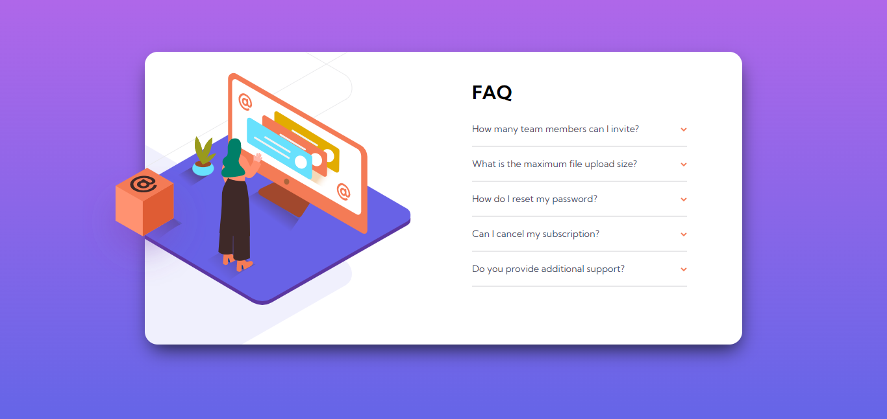
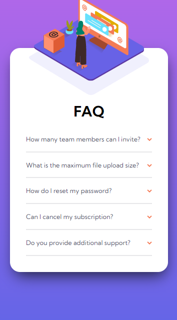

# Frontend Mentor - Social Proof Section solution

This is a solution to the [Faq Accordion Card challenge on Frontend Mentor](https://www.frontendmentor.io/challenges/faq-accordion-card-XlyjD0Oam). Frontend Mentor challenges help you improve your coding skills by building realistic projects. 

## Table of contents

- [Screenshot](#screenshot)
- [Links](#links)
- [My process](#my-process)
  - [Built with](#built-with)
  - [Useful resources](#useful-resources)
- [Author](#author)

### Screenshot

### Links

- Live Site URL: [Click here](https://faq-cordion-solution.surge.sh/)

## My process

### Built with

- BEM (Block Element Modifier)
- SCSS
- Flexbox
- Desktop-first workflow

### Useful resources

- [SASS Docs](https://sass-lang.com/documentation) - This helped me for understanding basic of SCSS forward.
- [Overflow css](https://css-tricks.com/almanac/properties/o/overflow/)

## Author

- Website - [Moch. Ilham Afandi](https://github.com/afandilham)
- Frontend Mentor - [@afandilham](https://www.frontendmentor.io/profile/afandilham)
- Twitter - [@afandilham](https://www.twitter.com/afandilham)