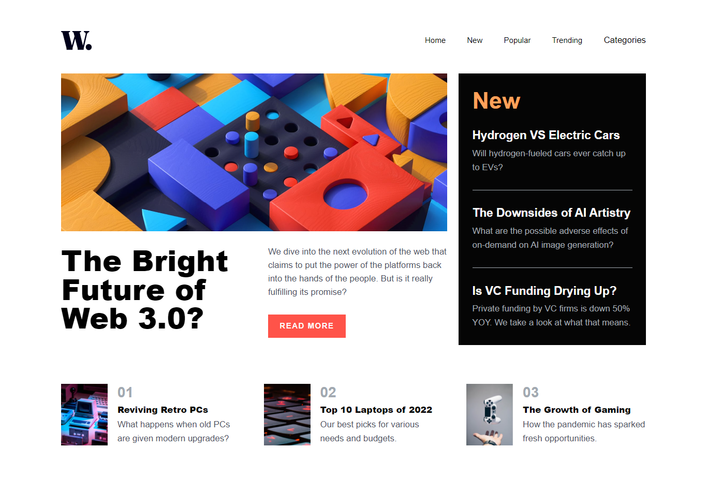

# Frontend Mentor - News-homepage

This is a solution to the [News Homepage challenge on Frontend Mentor](https://www.frontendmentor.io/challenges/news-homepage-H6SWTa1MFl/hub). Frontend Mentor challenges help you improve your coding skills by building realistic projects.

## Table of contents

- [Overview](#overview)
  - [The challenge](#the-challenge)
  - [Screenshot](#screenshot)
  - [Links](#links)
- [My process](#my-process)
  - [Built with](#built-with)
- [Author](#author)

## Overview

### The challenge

Users should be able to:

- View the optimal layout for the site depending on their device's screen size
- See hover states for all interactive elements on the page

### Screenshot

1. Desktop screenshot

2. Mobile screenshot

### Links

- Solution URL: [link](https://github.com/afandilham/frontend-mentor-challenge/tree/main/news-homepages)
- Live Site URL: [Link](https://savory-face.surge.sh/)

## My process

### Built with

- Tailwindcss
- [Vue](https://vuejs.org/) - JS library

## Author

- Frontend Mentor - [@afandilham](https://www.frontendmentor.io/profile/afandilham)
- Twitter - [@afandilham](https://www.twitter.com/afandilham)
