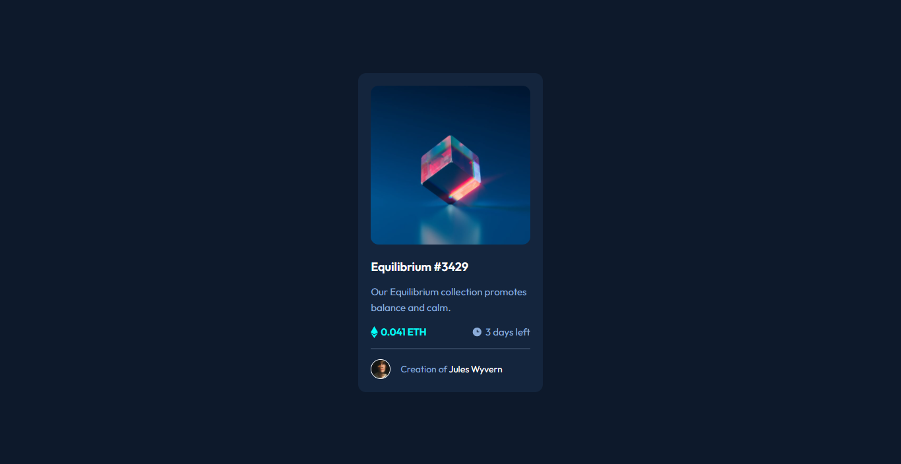

# Frontend Mentor - NFT preview card component solution

This is a solution to the [NFT preview card component challenge on Frontend Mentor](https://www.frontendmentor.io/challenges/nft-preview-card-component-SbdUL_w0U). Frontend Mentor challenges help you improve your coding skills by building realistic projects. 

## Table of contents

- [The challenge](#the-challenge)
- [Screenshot](#screenshot)
- [Links](#links)
- [My process](#my-process)
  - [Built with](#built-with)
  - [What I learned](#what-i-learned)
  - [Continued development](#continued-development)
  - [Useful resources](#useful-resources)
- [Author](#author)

### The challenge

Users should be able to:

- View the optimal layout depending on their device's screen size
- See hover states for interactive elements

### Screenshot



### Links

- Live Site URL: [Click here](http://nft-preview-card.surge.sh/)

## My process

### Built with

- BEM (Block Element Modifier)
- SCSS
- Flexbox
- Desktop-first workflow


### What I learned

To see how you can add code snippets, see below:

1. extend
```scss
@extend %to-center-list;
```

2. mixins
```scss
@mixin xs {
  @media (max-width: map-get($breakpoints, "xs")) {
    @content;
  }
}
```

### Continued development

Use this section to outline areas that you want to continue focusing on in future projects. These could be concepts you're still not completely comfortable with or techniques you found useful that you want to refine and perfect.

**Note: Delete this note and the content within this section and replace with your own plans for continued development.**

### Useful resources

- [SASS Docs](https://sass-lang.com/documentation) - This helped me for understanding basic of SCSS forward.

## Author

- Website - [Moch. Ilham Afandi](https://github.com/afandilham)
- Frontend Mentor - [@afandilham](https://www.frontendmentor.io/profile/afandilham)
- Twitter - [@afandilham](https://www.twitter.com/afandilham)
