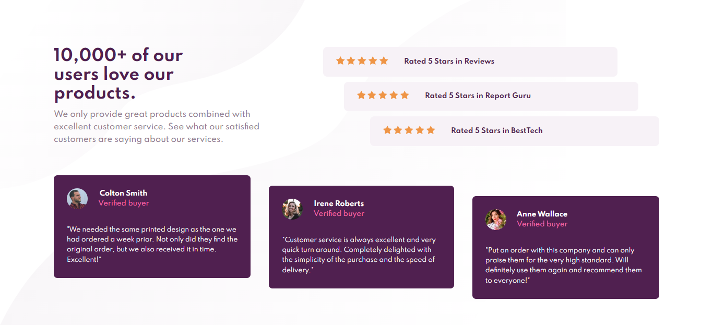
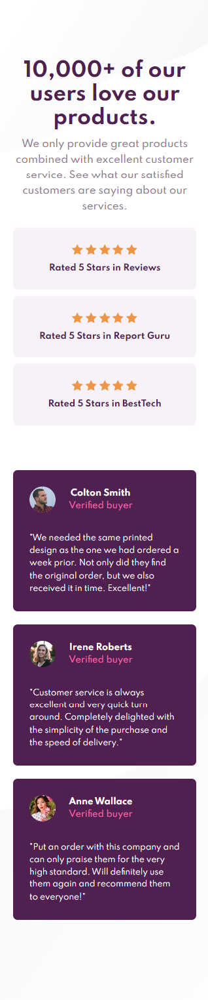

# Frontend Mentor - Social Proof Section solution

This is a solution to the [Social Proof Section challenge on Frontend Mentor](https://www.frontendmentor.io/challenges/social-proof-section-6e0qTv_bA). Frontend Mentor challenges help you improve your coding skills by building realistic projects. 

## Table of contents

- [Screenshot](#screenshot)
- [Links](#links)
- [My process](#my-process)
  - [Built with](#built-with)
  - [What I learned](#what-i-learned)
  - [Useful resources](#useful-resources)
- [Author](#author)


### Screenshot

1. Desktop


2. Mobile



### Links

- Live Site URL: [Click here](https://sc-proof-section.surge.sh/)

## My process

### Built with

- BEM (Block Element Modifier)
- SCSS
- Flexbox
- GRID
- Desktop-first workflow


### What I learned

To see how you can add code snippets, see below:

**@for**
```scss
@for $i from 2 through 3 {
  &-card:nth-child(#{$i}) {
    margin: 0;
  }
}
```

### Useful resources

- [SASS Docs](https://sass-lang.com/documentation) - This helped me for understanding basic of SCSS forward.

## Author

- Website - [Moch. Ilham Afandi](https://github.com/afandilham)
- Frontend Mentor - [@afandilham](https://www.frontendmentor.io/profile/afandilham)
- Twitter - [@afandilham](https://www.twitter.com/afandilham)